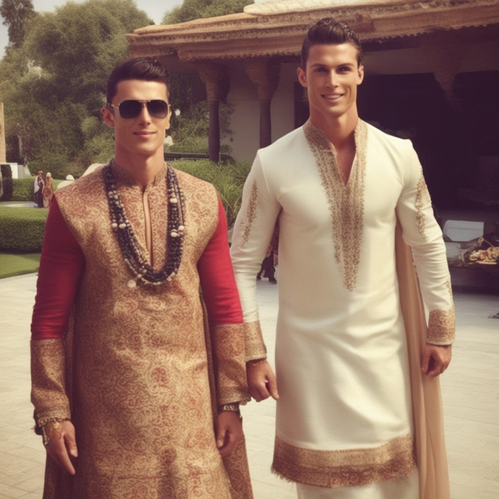
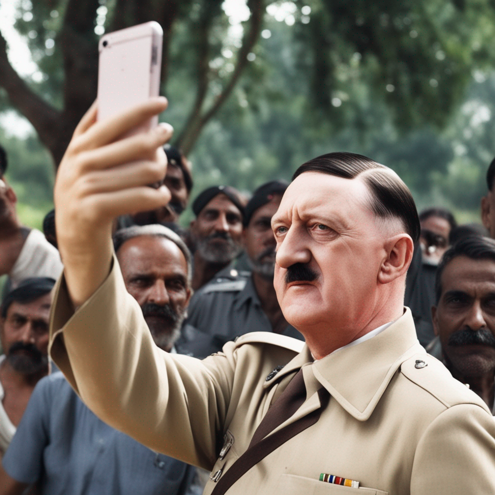
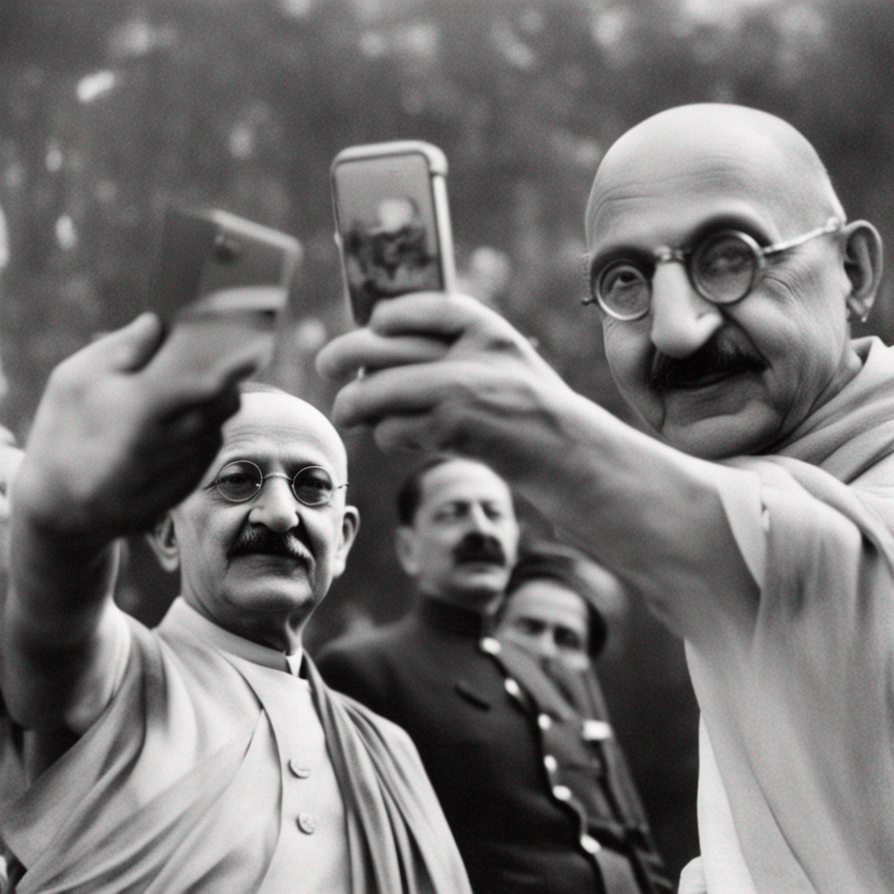
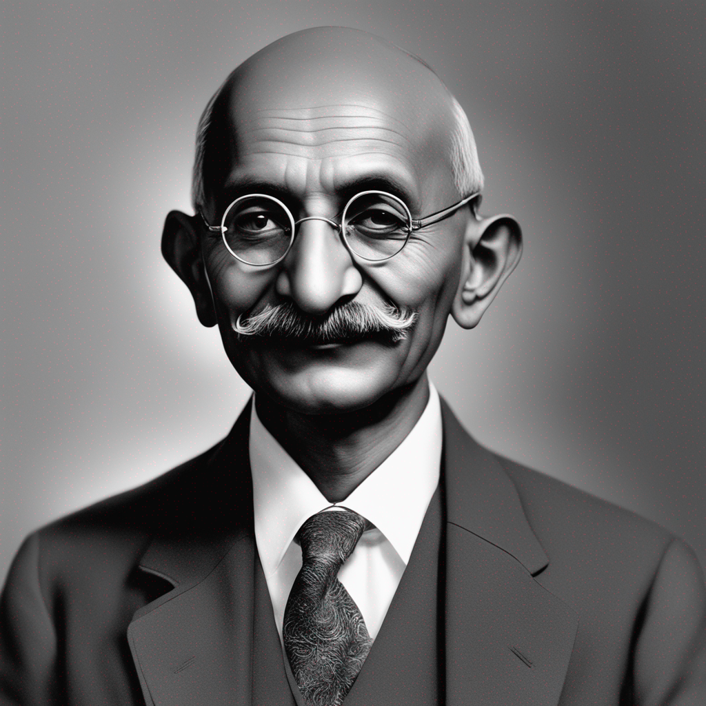
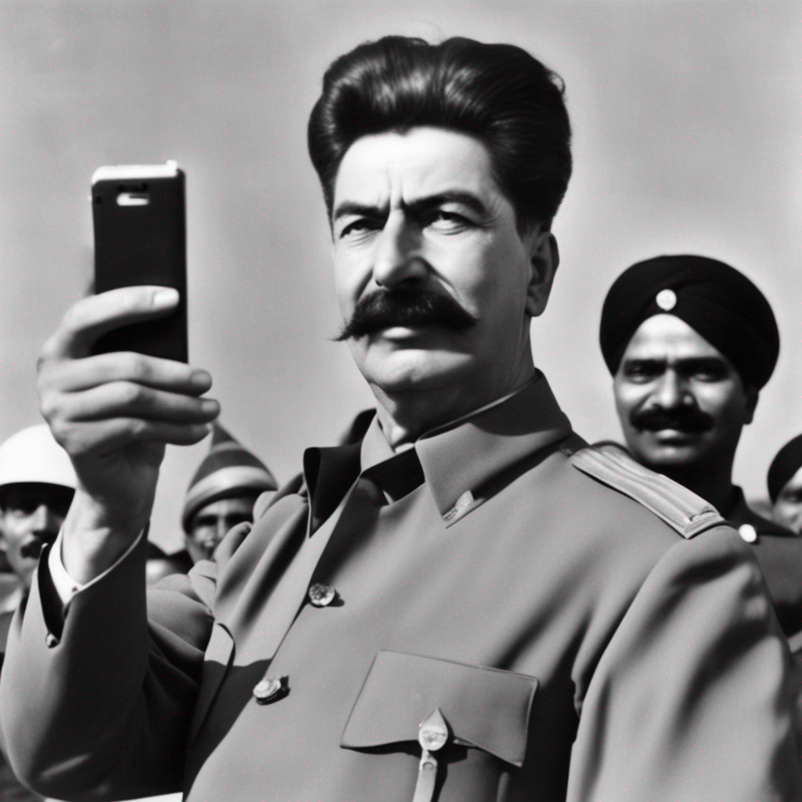
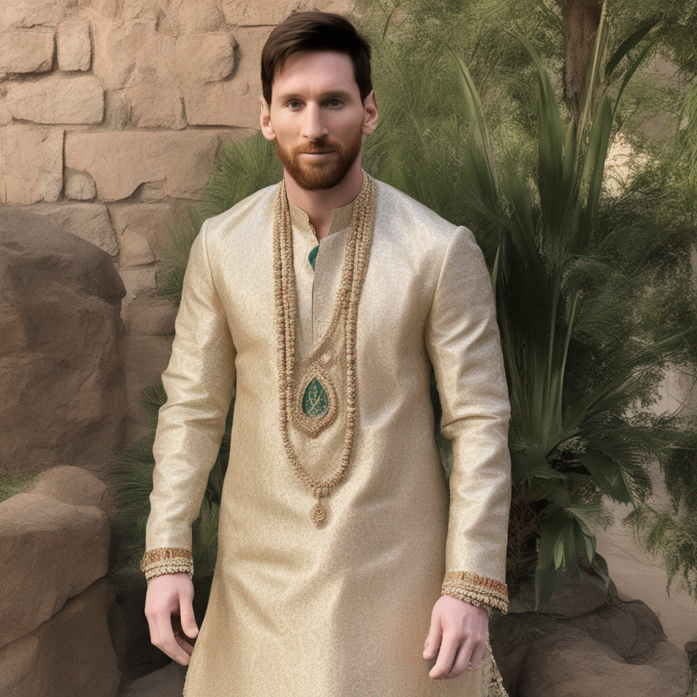

# Image_Generate_Using_Text_Clipdrop

Web application using Python Flask for backend and HTML, Bootstrap for Frontend
The Main Motive of the application is to generate image using Text
For that we are using Clipdrop API to create this tool!.

Images created using the web app:

